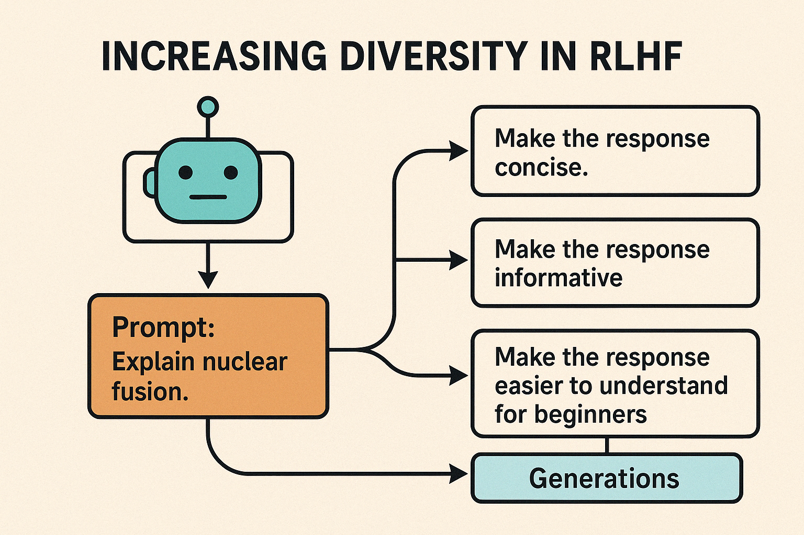

# Increasing Diversity in RLHF

This project investigates how increasing diversity in the RLHF (Reinforcement Learning from Human Feedback) pipeline can improve exploration and reward optimization. We use prompt-level edits (e.g., "make it concise") to encourage varied generations from the language model.

---

## 📁 Project Files

- **CS234_Final_Report.pdf**  
  Final report describing the full methodology, experiments, and findings.

- **trained_model_inference.ipynb**  
  Notebook to sample generations from the LLM using prompt edits.

- **reward_modeling.ipynb**  
  Applies a reward model to score each generation.

- **sft_phi2.ipynb**  
  Performs supervised fine-tuning using top-scoring generations.

---

## Acknowledgments

This project was developed for **CS234 (Reinforcement Learning)** at Stanford University.  
Special thanks to **Emma Brunskill** and the teaching staff.

**Authors:**
- Ifdita Hasan Orney  
- Zhuoer Gu  
- Eric Han
